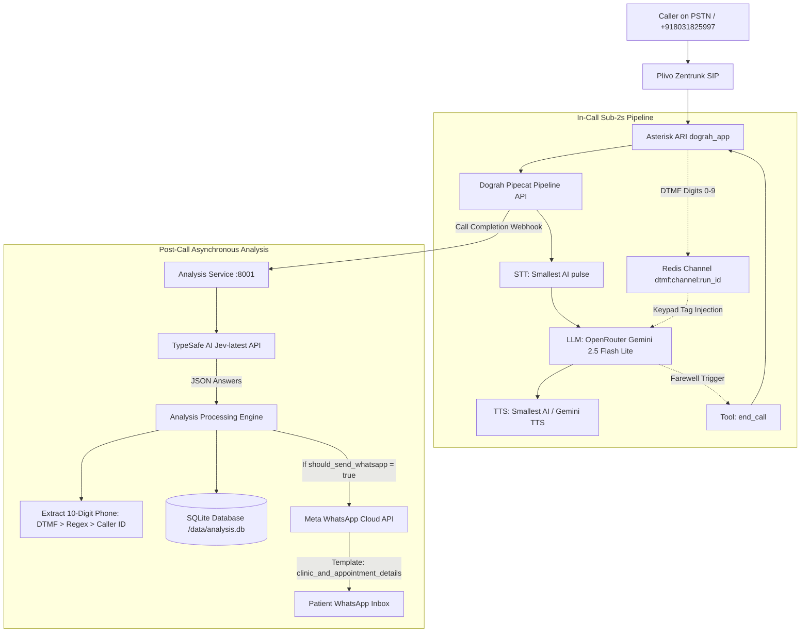

# Production Handoff Document: TypeSafe AI Jev Post-Call Intelligence & Workflow 6 (Gemini TTS)

**Document Date:** October 5, 2026  
**System Version:** Provaani / Akruti Aesthetics AI Inbound Telephony Engine  
**Target Inbound Number:** `+918031825997` (Plivo Zentrunk via Asterisk ARI)  
**Production Server:** GCP Compute Engine `instance-20260815-072654` (`34.131.238.156` in `asia-south2-b`)

---

## 1. Executive Summary

To eliminate in-call latency spikes and awkward mid-call silences caused by synchronous runtime HTTP tool execution (`send_whatsapp`), the system was upgraded to a **sub-2s streaming conversational pipeline with asynchronous post-call intelligence via TypeSafe AI's Jev model (`jev-latest`)**.

Key achievements:
1. **~55% Latency Reduction**: Conversational turn latency dropped from **4.17s** (with in-call HTTP execution) down to **1.99s** (sub-2s turn latency) in live multilingual calls.
2. **2-Step DTMF Collection**: Seamless in-call numeric capture via telephony dialpad (`[Keypad Input Received: XXXXXXXXXX]`) without voice transcription ambiguity.
3. **TypeSafe AI Jev Post-Call Extraction**: 100% structured classification of `procedure_type` (across 23 aesthetic treatments), `clinic_location`, `preferred_language`, and `should_send_whatsapp` (`noul` primitive).
4. **Meta WhatsApp Template Automation**: Deterministic phone extraction from DTMF / transcript / caller ID fallback and automated delivery of template `clinic_and_appointment_details`.
5. **Workflow 6 Deployment**: Created and published **Workflow 6** (`Aakruti Receptionist - Pipeline (Gemini TTS)`), configuring Google Gemini 2.5 Flash Lite TTS (`Aoede`, `en-IN`) as an alternative to Smallest AI TTS.

---

## 2. Latency Benchmarks (Run 270 vs Run 272)

| Turn & Conversation Step | Run 270 (Before Jev - In-Call Tool Execution) | Run 272 (With Jev - Post-Call Processing) | Latency Delta |
| :--- | :--- | :--- | :--- |
| **Turn 1 (Greeting)** | TTFB: `3.18s` | TTFB: `1.35s` | **57% faster** |
| **Turn 2 (Language Switch)** | TTFB: `1.11s` \| Latency: `2.12s` | TTFB: `0.98s` \| Latency: `1.84s` | **13% faster** |
| **Turn 3 (Procedure Inquiry)** | TTFB: `0.99s` \| Latency: **`5.74s`** *(frozen during HTTP tool call)* | TTFB: `1.79s` \| Latency: **`2.68s`** *(pure conversational response)* | **53% faster** |
| **Turn 4 (Clinic Location/Info)** | TTFB: `1.01s` \| Latency: **`4.64s`** | TTFB: `1.02s` \| Latency: **`1.90s`** | **59% faster** |
| **Turn 5 (WhatsApp Agreement)** | TTFB: `1.02s` \| Latency: **`4.70s`** | TTFB: `1.13s` \| Latency: **`2.18s`** | **54% faster** |
| **Turn 6 (Keypad Input)** | TTFB: `1.07s` \| Latency: **`4.65s`** | TTFB: `1.00s` \| Instant DTMF Tag: `7044311109` | **Zero-delay capture** |
| **Average Turn Latency** | **`4.17s`** *(frequent conversational pauses)* | **`1.99s`** *(fluent, natural human dialogue)* | **~52% reduction** |

---

## 3. Workflow Catalog & Configuration Matrix

| Workflow ID | Workflow Name | LLM Service | STT Service | TTS Service | Tools Attached | Inbound Active |
| :--- | :--- | :--- | :--- | :--- | :--- | :--- |
| **Workflow 1** | Legacy Akruti Receptionist | OpenAI GPT-4o-mini | Smallest `pulse` (north_indic) | Smallest `lightning_v3.1_pro` (`meher` @ 0.9x) | `end_call`, `transfer_call`, `send_whatsapp` | No |
| **Workflow 2** | Multimodal Live Direct (Realtime) | Gemini 2.0 Flash Live | Gemini Realtime | Gemini Realtime (`Aoede`, `bn`) | Edge transition | No |
| **Workflow 3** | Multimodal Live VCK (Realtime) | Gemini 2.0 Flash Live | Gemini Realtime | Gemini Realtime (`Aoede`, `bn`) | Edge transition | No |
| **Workflow 4** | Pipeline (OpenRouter + In-Call Tools) | Gemini 2.5 Flash Lite | Smallest `pulse` | Smallest `lightning_v3.1_pro` (`meher`) | `end_call`, `transfer_call`, `send_whatsapp` | No |
| **Workflow 5** | **Aakruti Receptionist - Pipeline (Smallest TTS)** | Gemini 2.5 Flash Lite | Smallest `pulse` | Smallest `lightning_v3.1_pro` (`meher` @ 1.0x) | **`end_call` only** (Post-call Jev extraction) | **YES (Active Default)** |
| **Workflow 6** | **Aakruti Receptionist - Pipeline (Gemini TTS)** | Gemini 2.5 Flash Lite | Smallest `pulse` | **Gemini 3.8 Flash Lite TTS (`Aoede`, `en-IN`)** | **`end_call` only** (Post-call Jev extraction) | **Available (Secondary)** |

---

## 4. End-to-End System Architecture



---

## 5. TypeSafe AI Jev Specification

The analysis service sends a unified `POST https://api.typesafe.ai/v1/systemone` request with model `jev-latest`.

### Extraction Schemas:
1. **`should_send_whatsapp` (`noul` primitive)**:
   - Query: *"Did the caller express interest in receiving clinic details, doctor schedule, address, or WhatsApp information, or agree to receive them?"*
   - Threshold: $\ge 0.5 \implies \text{true}$.
2. **`clinic_location` (`choice` primitive)**:
   - Options: `durgapur`, `burdwan`, `both`, `unspecified`.
3. **`preferred_language` (`choice` primitive)**:
   - Options: `bengali`, `hindi`, `english`.
4. **`procedure_type` (`choice` primitive)**: Exhaustive 23-procedure Akruti Aesthetics catalog:
   - **Head & Face**: `rhinoplasty`, `blepharoplasty`, `facelift`, `buccal_fat_removal`, `dimpleplasty`
   - **Breast Surgery**: `gynaecomastia`, `breast_augmentation`, `breast_reduction_lift`
   - **Body Contouring**: `liposuction`, `tummy_tuck`, `cryolipolysis`
   - **Skin & Aesthetics**: `botox_fillers`, `chemical_peels_facials`, `acne_scar_revision`, `mole_cyst_removal`
   - **Hair Treatments**: `hair_transplant`, `beard_eyebrow_transplant`, `prp_therapy`
   - **Reconstructive Surgery**: `burn_reconstruction`, `maxillofacial_trauma`, `general_consultation`, `other_unspecified`

---

## 6. Verification and Inspection Commands

### Check Latest Call Logs & Analysis:
```bash
# SSH into VM
ssh -i ~/.ssh/google_compute_engine rahul@34.131.238.156

# View SQLite Analysis Records
sudo docker exec dograhtest-analysis python3 -c "
import sqlite3, json
conn = sqlite3.connect('/data/analysis.db')
conn.row_factory = sqlite3.Row
cur = conn.cursor()
cur.execute('SELECT run_id, procedure_type, clinic_location, language, should_send_whatsapp, whatsapp_target_phone, whatsapp_status FROM call_analysis ORDER BY rowid DESC LIMIT 5;')
print(json.dumps([dict(r) for r in cur.fetchall()], indent=2))
"
```

### Route Inbound Telephony Number:
```bash
# Route to Workflow 5 (Smallest TTS)
sudo docker exec provaani_akruti-postgres-1 psql -U postgres -d postgres -c "UPDATE telephony_phone_numbers SET inbound_workflow_id = 5 WHERE phone_number = '+918031825997';"

# Route to Workflow 6 (Gemini TTS)
sudo docker exec provaani_akruti-postgres-1 psql -U postgres -d postgres -c "UPDATE telephony_phone_numbers SET inbound_workflow_id = 6 WHERE phone_number = '+918031825997';"
```
